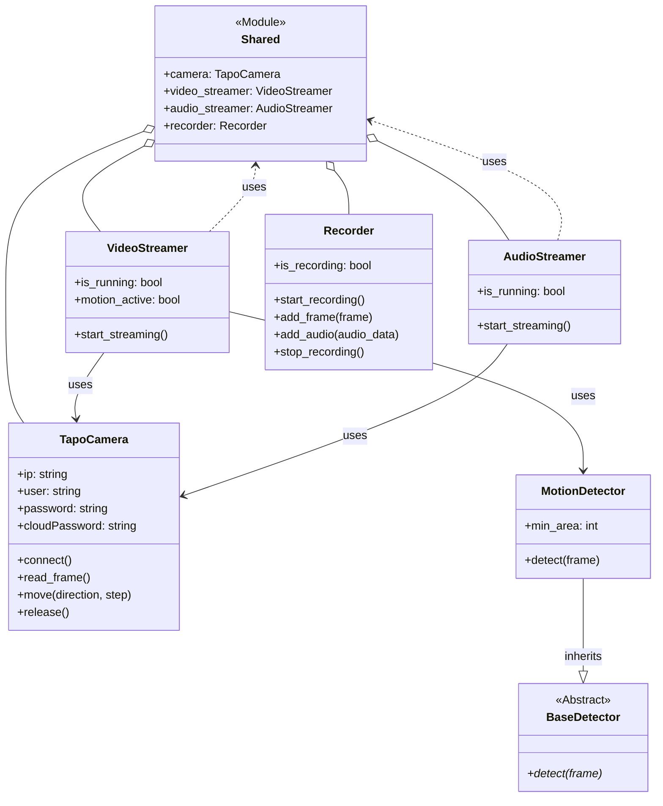

Powyższy kod w formacie Mermaid reprezentuje zaktualizowany diagram klas dla Twojej aplikacji, uwzględniając obiekty współdzielone.

**Główne zmiany:**

-   **Moduł `Shared`**: Dodano klasę `Shared` ze stereotypem `<<Module>>`, aby przedstawić plik `app/shared.py`. Przechowuje on globalnie dostępne instancje głównych klas (`TapoCamera`, `VideoStreamer`, `AudioStreamer`, `Recorder`). Relacja kompozycji (`o--`) pokazuje, że te obiekty są częścią `Shared`.
-   **Relacje z `Shared`**: Klasy `VideoStreamer` i `AudioStreamer` mają teraz relację `uses` (pokazaną jako przerywana linia `..>`) z modułem `Shared`. Oznacza to, że uzyskują dostęp do współdzielonych obiektów (w tym przypadku `Recorder`) za pośrednictwem tego modułu, a nie bezpośrednio.

Dzięki temu diagram dokładniej odzwierciedla architekturę aplikacji, gdzie centralny moduł `shared` zarządza kluczowymi obiektami i udostępnia je innym częściom systemu.
